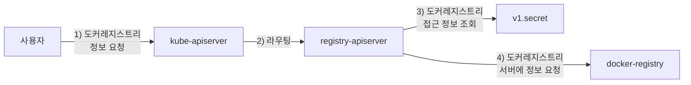

# registry-apiserver

## 목표

도커 레지스트리 정보를 쿠버네티스 환경에서 제어하는 기능을 제공한다.

## 구성

```mermaid
flowchart LR
  user[사용자] --"1) 도커레지스트리\n정보 요청"--> kubeapi[kube-apiserver]
  kubeapi --"2) 라우팅"--> regapi[registry-apiserver]
  regapi --"3) 도커레지스트리\n접근 정보 조회"--> v1.secret
  regapi --"4) 도커레지스트리\n서버에 정보 요청"---> dockerreg[docker-registry]
```

## 개발환경

* ubuntu 20.04
* go 1.16
* kubectl 1.22
* helm 3.8.0
* minikube 1.25.2
* kubebuilder 3.2.0
